# Capstone Project
<b>Lucy Gray and Harriet Novak</b>

## Table of Contents

<details>
<summary><b> <a href="https://github.com/lgray52/CapstoneProject/blob/main/README.md#planning--proposal">Planning + Proposal</a> </b></summary>


<br><a href="https://github.com/lgray52/CapstoneProject/blob/main/README.md#notes">☢ Notes</a>

<a href="https://github.com/lgray52/CapstoneProject/blob/main/README.md#initial-timeline">☢ Timeline</a>

</details>  

<details>
<summary><b> <a href="https://github.com/lgray52/CapstoneProject/blob/main/README.md#trebuchet">Trebuchet</a> </b></summary>

 <br> <a href="https://github.com/lgray52/CapstoneProject/blob/main/README.md#onshape-design">☢ Onshape Design</a>
 
 <a href="https://github.com/lgray52/CapstoneProject/edit/main/README.md#prototype">☢ Prototype</a>

<a href="https://github.com/lgray52/CapstoneProject/blob/main/README.md#cad-imports">☢ CAD Imports</a>

<a href="https://github.com/lgray52/CapstoneProject/blob/main/README.md#references">☢ References</a>

<a href="https://github.com/lgray52/CapstoneProject/blob/main/README.md#frame">☢ Frame</a>

<a href="https://github.com/lgray52/CapstoneProject/blob/main/README.md#arm-and-counterweight">☢ Arm + Counterweight</a>

<a href="https://github.com/lgray52/CapstoneProject/blob/main/README.md#release-mechanism--sling">☢ Release Mechanism + Sling</a>

<a href="https://github.com/lgray52/CapstoneProject/blob/main/README.md#weekly-reports">☢ Weekly Report</a>

  </details>
<details>
<summary><b><a href="https://github.com/lgray52/CapstoneProject/blob/main/README.md#projectile">Projectile</a></b></summary>
 
 <br> <a href="https://github.com/lgray52/CapstoneProject/blob/main/README.md#projectile-planning">☢ Planning</a>
 
 <a href="https://github.com/lgray52/CapstoneProject/blob/main/README.md#cad">☢ CAD</a>
 
 <a href="https://github.com/lgray52/CapstoneProject/blob/main/README.md#code">☢ Code</a>
 
 <a href="https://github.com/lgray52/CapstoneProject/blob/main/README.md#physical">☢ Physical</a>
 
</details>

<details>
<summary><b> <a href="https://github.com/lgray52/CapstoneProject#launch">Launching</a> </b></summary>

</details> 

<details>
 <summary><b><a href="https://github.com/lgray52/CapstoneProject/blob/main/README.md#desk-trebuchet">Desk Trebuchet</a> </b></summary>

 <br><a href="https://github.com/lgray52/CapstoneProject/blob/main/README.md#overview">☢ Overview</a>
 
 <a href="https://github.com/lgray52/CapstoneProject/blob/main/README.md#onshape-design-1">☢ OnShape Design</a>
 
 <a href="https://github.com/lgray52/CapstoneProject/blob/main/README.md#physical-design">☢ Physical Design</a>
 
 <a href="https://github.com/lgray52/CapstoneProject/blob/main/README.md#pulley-system">☢ Pulley System</a>
 
 <a href="https://github.com/lgray52/CapstoneProject/blob/main/README.md#release-system">☢ Release System</a>
 
 <a href="https://github.com/lgray52/CapstoneProject/blob/main/README.md#whipper-model">☢ Whipper Trebuchet Model</a>
 
</details>

## Planning + Proposal

### [Project Proposal](https://docs.google.com/presentation/d/1A54yDAdwB12cYQLXnSLfvfrEEuOk4ihk-hy-DLZa5EU/edit?usp=sharing)

<b>Client:</b> Mr Manning

First meeting: 09.07.22

<b>Client requirements:</b>
* must be mobile
* width less than a meter
* arm removable to reduce height
* has to fit through the door.  

### Notes


### Initial Timeline

* <b>Mid-October:</b> Onshape model complete and mini prototype
* <b>Mid-November:</b> Frame built
* <b>End of December:</b> Arm built
* <b>End of February:</b> Counterweight working with arm and frame
* <b/>By April:</b> Sling working successfully
* <b>By end of May:</b> Projectile working

## Purchased parts

* 2x 1in diameter ball bearing
* 4x 1in diameter stop collar
* 4x heavy duty caster wheels 
* varying weight plates: initially 2x 20lb plates
* 4x steel eyebolt with nut for lifting
* Rubber sheet/piece of rubber

[Back to Table of Contents](https://github.com/lgray52/CapstoneProject/blob/main/README.md#table-of-contents)

# Trebuchet
## Onshape Design 
[Link to Onshape document](https://cvilleschools.onshape.com/documents/b8765a261cadb44dcc0a336f/w/460002218d581b442cca053e/e/edba871aaf70a30a2c2fe965?renderMode=0&uiState=632dd17a483c184e28f44d74)

### CAD imports
* Caster wheel CAD [file](https://www.mcmaster.com/caster-wheels/cart-smart-casters-with-rubber-wheels/)
* Ball bearing CAD [file](https://www.mcmaster.com/bearings/ball-bearings/ball-bearings-8/); for 1in diameter pipe R16
* Stop collar CAD [file](https://www.mcmaster.com/stop-collars/extra-grip-clamping-shaft-collars/); for 1in diameter pipe R16
* Screw Eye CAD [file](https://www.mcmaster.com/3016T14/): 

### Notes for document

* Material used for 2x4s is birch instead of the pine that will be used in real life
* Actual dimensions for 2 x 4 is 1.5 x 3.5in which was accounted for in design

### References

* Reference for [axle](https://www.lowes.com/pd/Southland-Pipe-3-4-in-x-36-in-150-PSI-Threaded-Galvanized-Pipe/3357860)
* Video release [speed tracker](https://physlets.org/tracker/)


## Prototype

Our first prototype is a 15:1 model. Despite popsicle sticks not being exactly proportional to the 2x4s we will use for the final product, we used our Onshape model to scale the dimensions as accurately as possible. 

<b>Dimensions:</b>

Base: 11.8cm x 7.2cm 

Height of frame : 11.1 cm

Height with arm fully extended: 21.8 cm

   

We used a battery as the counterweight and attached it to the arm. The projectile was a small ball of paper covered in hot glue. One issue with prototyping with popsicle sticks was getting the arms of the frame to be exactly 30 degrees from the vertical. Because of this, we had to adjust the base dimensions and therefore they are not directly proportional to the base size we will use for the actual trebuchet. 

Our initial sliphook (a piece of wire) was too long which caused the sling to release too late. Our final sliphook was much shorter and was at about a 45 degree angle. The key was getting the sling to release before the arm was completely vertical at 0 degrees. 

We also had issues with the sling, because the pouch to hold the projectile was made of paper. Because the pouch did not really form around the projectile, it would slip out immediately. This problem should be solved with the actual trebuchet because the pouch will be made out of cloth. 

With the final product, our plan is to use stop collars to stop the trebuchet arm from moving horizontally along the axis. For the prototype, we put some hot glue on the axle (a q-tip stick) to minimize walking. 

## Frame

#### Initial design

Floating A-frame from pine 2x4 boards. Frame approximately 2m high excluding height of arm. 

Onshape Model: 09.27.22 : approximately 140lbs, 64in

  

### Parts

Plywood base: 31.5 x 59.25 in (0.75 in thick)

Heavy duty caster wheels (x4)

#### Lumber (2x4)

* 60 in (X2)
* 59.25 in (x2)
* 55.75 in (x4)
* 34.5 in (x2)
* 59.25 in (x2)
* 31.5 in (x2)
* 34.5 in (x1)


### Gusset Plates

#### Use + Design on Onshape


We used 1/4 in plywood, cut with table saw and chop saw. We had to shorten them from the initial planned length in order to use plywood that was already available in the lab. 

Here is Lucy using the chop saw: 

  

<b>Final Product</b>


### Body

Our planned dimensions for the base are 31.5 x 59.25 in. We found that plywood was very expensive and buying a 4 x 8 ft piece of 3/4 in plywood would be more than half our budget. The revised plan is to use a 3 x 4 ft piece of plywood and then another smaller piece glued together and add more braces on the bottom. We should be able to find those sizes in the lab

We finished staining all of our pieces. It took us a long time because the stain had to dry over night and we couldn't do all sides at once. We also had to work outside on the loading dock because of the fumes from the wood stain. 


There is always some slight warping in 2x4s but we used a square frequently to check that all the angles were as close to 90 degrees as possible. We started with an H shape to get the foundation of the trebuchet frame before we attached it to the base. Shown below is a picture of the frame H standing by itself. We used a hack saw to cut through the pipe for the axle, which was time and labor-consuming. For other pipe pieces we need, we may end up using the chop saw instead. 


The screws we got were 3in and went through both 2x4s, so the tip of the screw poked out on the other side. We had to use the dremel to remove them. 


The lengths of the angled pieces were not perfect, as the chop saw was not easy to get exact angles, but it fit together well. The frame is very stable in all directions. 


The casters were attached last, and the trebuchet is very easy to move around. We used two 5 in casters in the back and two 5 in wheels in the front. We decided to put the wheels in the front, because when it lauches it will move a bit, and we dont want it to be able to move in more than one direction. 

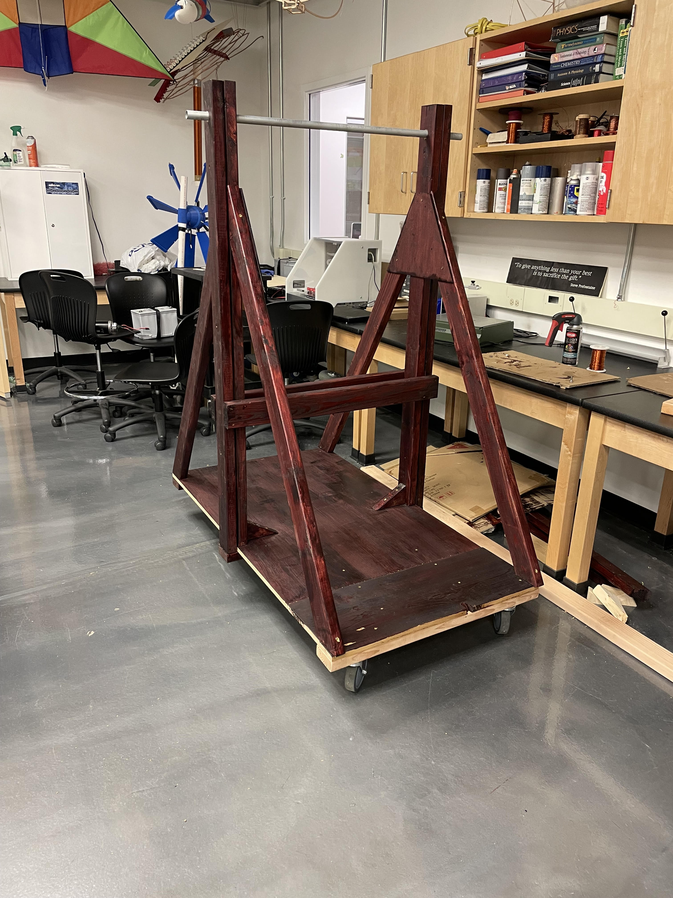

Jan 3: We took the trebuchet outside to test the arm and bumper together. As we were rolling it back inside, part of the base cracked. 

 

Our base was made from two pieces: a large piece of high quality plywood and a piece of scrap that we found in the lab. The piece of scrap cracked along the grain despite the supports we put underneath it. We think it was because of the poor quality of the wood (which admittedly was warped). Instead of replacing the plank, we used clamps to glue the pieces back together. Because people in the lab don't seem to understand how to use or store glue, the wood glue was almost completely solid. To glue up the crack we used a combination of liquid wood glue and the glue putty that was remaining in the tube, which we used like caulk. The top side of the base (the side that is visible), now has a long white line in it which is unfortunate. We will try and cover it up in some way so that the appearance of the stain is not ruined. We also added additional supports out of planks of wood to the bottom, reinforcing both sides of the crack. 

  

<b>2.10.23:</b> We were launching the trebuchet without the hose clamps keeping the weights in place, so they would fall off occasionally. One launch a weight fell off and onto the smaller section of the base, which caused it to crack again in a different place. We decided to replace the piece of wood instead of repairing it with glue again. We found the remaining piece of wood that came from the plywood we used for the larger piece of the base, which we used as a replacement. We reinforced the base much more strongly this time, which did cause a substantial increase in weight. We decided it was worth it to prevent future breakage. The image below shows the reinforcements we made. 

 

The picture below shows what it looks like from above. We will have to buy more stain to finish the base. 


## Arm and Counterweight

We had some issues with our materials which took awhile to figure out. The ball bearings we ordered were slightly too big for the axle, so we had to 3D print inserts so that the bearings would be friction fit to the pipe. The fit was very tight and we had to hammer it on. The hole cutter we used with the drill press also cut a hole that was slightly too large, so we ended up having to glue the bearings into the arm. To give the bearings extra support, we cut gussetts out of plywood and drilled them into the arm. Bottom left is the part in onshape, and bottom right is the part in use. 

  

Because we didn't have a substantial amount of money left in our budget, we decided to 3D stop collars instead of buying them. Our initial design is pictured below. 


We used D rings to attach the ropes going from the frame to the arm. Our plan is for the ropes to prevent the arm from moving 180 degrees. Once it reaches 90 degrees, the ropes will become taut and the arm will be brought back down. 


We tested some rudimentary ideas for a bumper using materials in the lab. As of Jan 7th, the plan is to have a rubber bumper for the arm to come down on. Our hope is it will take strain off of the arm and the frame. Our initial design was using foam, as suggested by Mr. Miller. The material is shown below. 


It was not very successful. We only used duct tape to hold it down, which of course was not a long-term solution, but still we threw the idea out. The frame was still taking a lot of shock, and the arm was cutting into the foam, which did not reform. Then we tried cutting up RC car wheels that were sitting unused in the lab. That is shown below. There are clear gouges in the sliphook plate on the arm, which came from it being just slightly wider than the 2x4. We will likely have to recut it, possibly even with thicker plywood. As for the tire bumper, it was better than the foam, but still not as successful as we hoped. We may try a combination of foam and tire, or get more serious scrap tires with thicker rubber. 

 

We ended up using two types of foam with RC car wheels stretched on top, which we then bolted onto the side of the trebuchet. 

 

When we tested our arm it worked very well, and appears to be nearly frictionless. 


## Release mechanism + Sling

### Sliphook and release

Our initial design in Onshape for the sliphook is pictured below. We designed it such that the angle of the sliphook can be changed to modify the launch. Otherwise, it would be much more difficult to make small changes once we are in the launch-test phase. Our plan is to cut the plate out of plywood and 3D print the actual hook.

 

We made our initial cut out of 5mm plywood. 


Unfortunately, as we were testing a bumper for the arm, it became clear that we made a poor choice in wood. The balsa got chewed up very quickly, and we decided that it would not be a good long-term solution. Because we are graduating and leaving Mr. Manning to deal with the trebuchet, we want to minimize the parts that he has to replace. We were also having issues with getting the sliphook tight enough. It turned out that the nut and bolt were just cutting into the wood, so it wasn't able to tighten as much as we wanted. 

 

We ended up cutting a new sliphook plate out of metal using the waterjet. The sliphook is now very firm and stays in place. We are also considering cutting the sliphook itself out of metal instead of 3D printed plastic. 


### Sling

We used [this](https://ourpastimes.com/make-trebuchet-sling-pouch-8537305.html) website to help us design our sling. 

The final product is shown below. We may want to test different sling designs, but as of our first week of launching, this sling appears to work pretty well. For the string we used string found in the lab, and the pouch was made from a canvas tote bag that we cut up. 

 

### Pin release

The pin trigger release was based on [this](https://www.youtube.com/watch?v=JZtZ3B_hxvs) video. A pin slides through three eyebolts, locking the arm down until the pin is pulled out from a safe distance. In order to minimize any risk of the pin slipping out prematurely, two of the eyebolts are connected to the base to create two pull down points and keeping the pin from pushing up at an angle like it would if it was only supported by one eyebolt in the base and the one on the arm. 

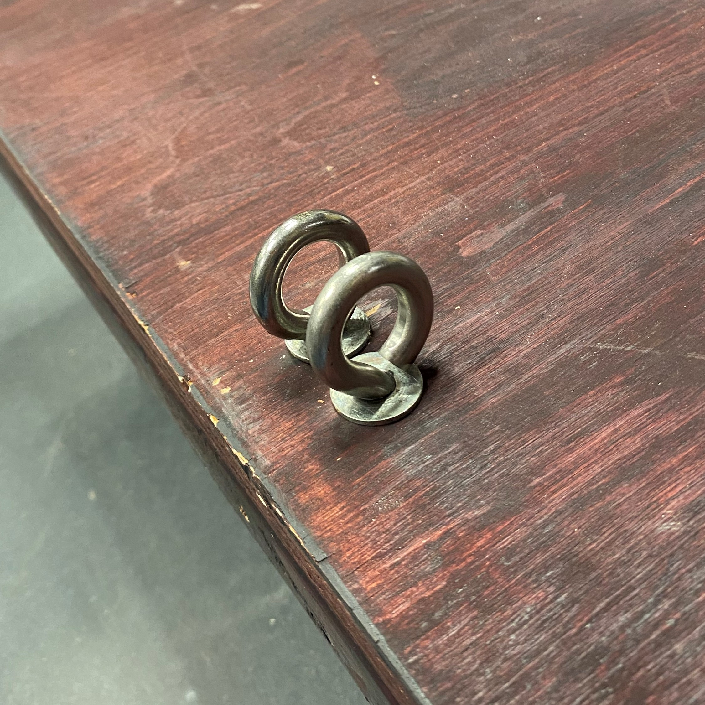 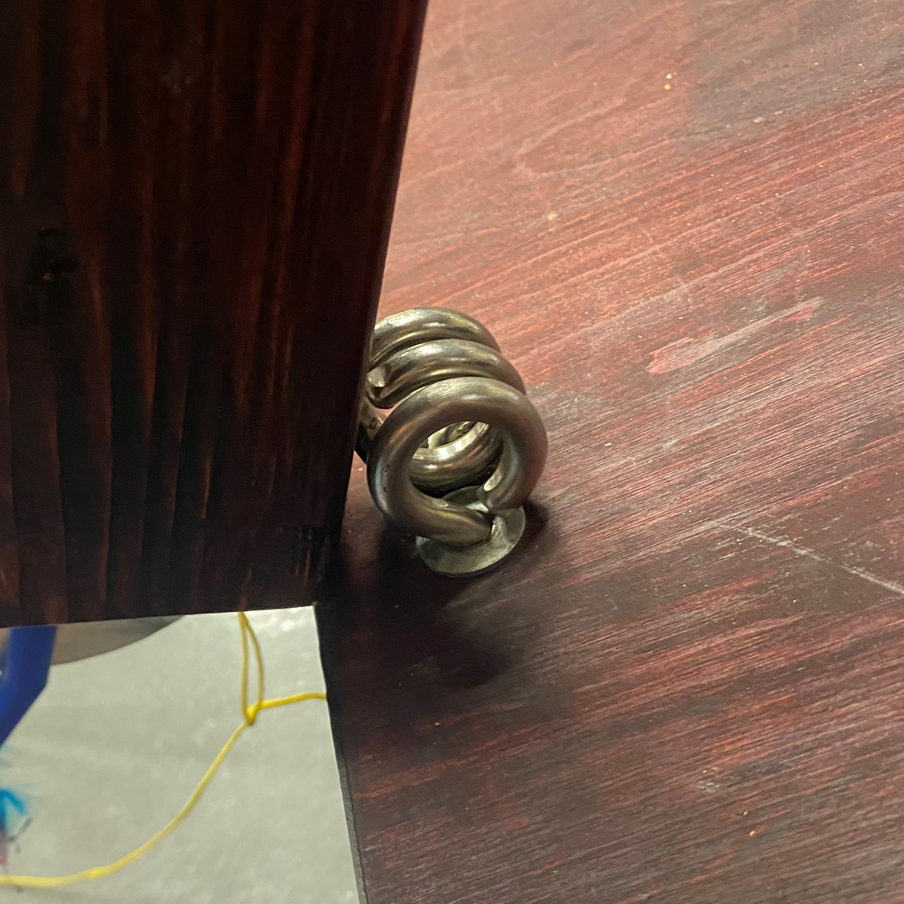 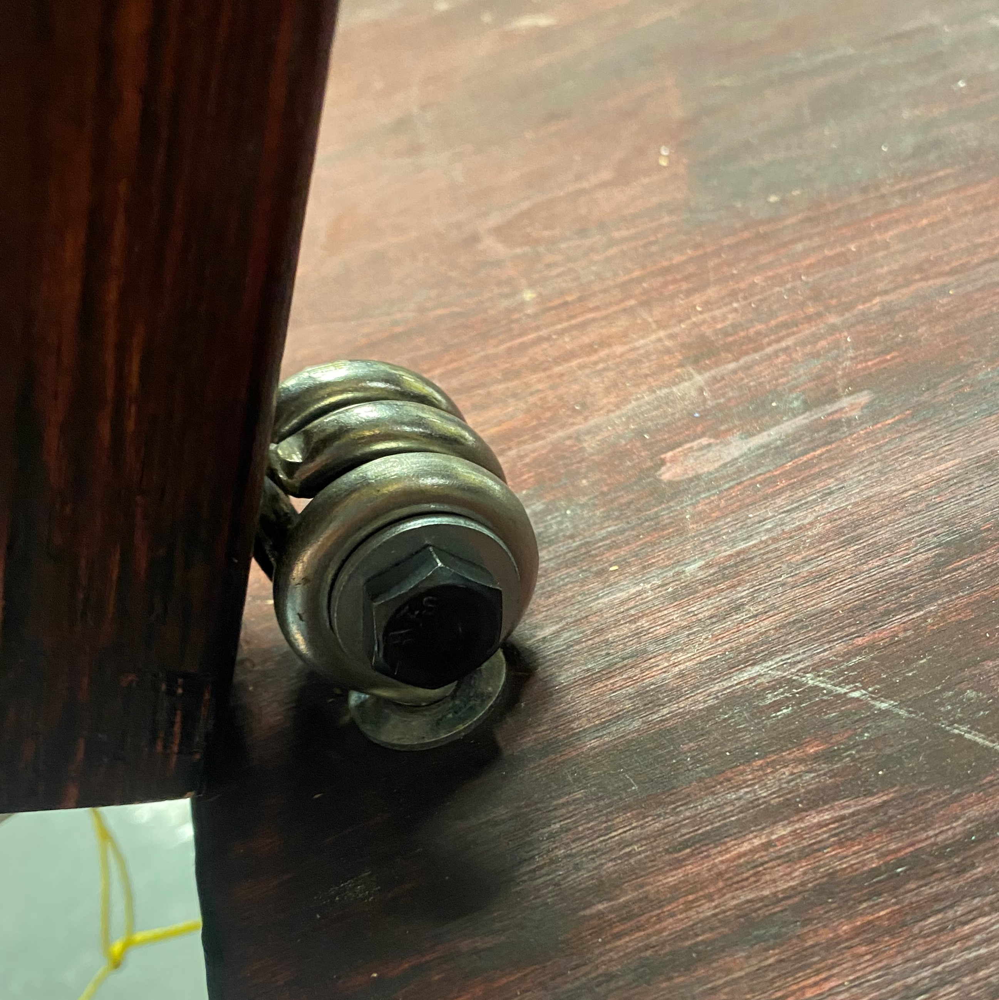

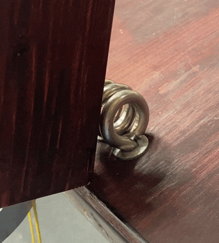 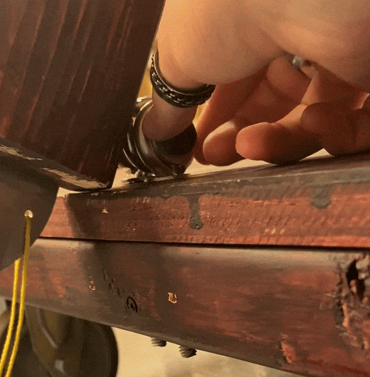 

## Weekly Reports

<b>10.3.22 - 10.7.22</b>: We built a 15:1 scale [prototype](https://github.com/lgray52/CapstoneProject/blob/main/README.md#prototype) out of popsicle sticks. Although we were using popsicle sticks, which don't directly translate to 2x4s, we used our onshape model to try and make the dimensions as accurate as possible. The end result launched a small projectile about 25 in. Our main issue was adjusting the slip hook so the sling would release at the correct time (at approx 45 degrees). We used a battery as the counterweight, so we tried using a slightly smaller counterweight, but this caused additional issues because it would not stay in the sling. This problem should be less of an issue with the full scale trebuchet, because we will be using cloth for the sling instead of paper, which didn't form around the projectile. 

<b> 10.10.22 - 10.14.22</b>: This week, we cut the gussets for the full scale trebuchet and finalized our cut list. We talked to our teachers about how we are going to get materials for the trebuchet from Lowe's while spending within the school's system, and had conversations about using materials from the lab. This led us to modify our design slightly to include support connectors so that we can use multiple pieces of plywood for the base, since the size of plywood sheet we would've needed for the base would have been very expensive. Our estimate for costs of wood and fasteners is about $60 to $65. 

<b> 10.17.22 - 10.21.22</b>: We got our wood from Lowes and cut it to the sizes we needed. We also got screws and a mahogany stain, which was approved by Mr. Manning.  Our total cost for fasteners, wood, and stain was about $83. We were able to cut all of our 2x4s and plywood, and have begun sanding and staining our pieces. The stain needs to set for 5 hours per coat and needs 2 coats, so the staining process will probably take a couple more classes, especially as we are working in the back hallway. We also might have to stain outside in the future, which will take significant amounts of time to move pieces in and out. 

<b> 10.24.22 - 10.26.22</b>: We continued staining this week. All of our wood has now been sanded, so we are ready to stain the remainder of our pieces. Since it was only a three day week, we could only get so much done in two classes. 

<b> 10.31.22 - 11.4.22</b>: This week we were able to start building the frame of the trebuchet. The base has been assembled apart from the wheels, and the upright supports have been put together and stand on their own. We made a slight change to the base design, and are now planning on including triangular support blocks that will attach the base to the vertical braces, improving stability and giving the vertical pieces a stronger connection to the base. All staining has been finished. Next week, we will continue to add to the frame and work on attaching it to the base. 

<b> 11.9.22 - 11.11.22</b>: This week continued building the frame of the trebuchet, and got everything attached to the base. We are basically done with the frame, we just have to attach the gussets. We are ahead of schedule and will likely start working on the arm next week. We only had two days to work this week, but we got a lot done. 

<b> 11.14.22 - 11.18.22</b>: We attached the gussets and put the wheels on the trebuchet. Thankfully, it fits through the door! We got casters from theater tech, but were only able to find three matching ones, so the trebuchet is a little bit unstable at the moment. We are hoping to get similarly sized wheels to put on the back, and we have ordered bearings for the arm. These will hopefully arrive sometime next week, but we are essentially done with the frame, putting us right on schedule. 

<b> 11.28.22 - 12.2.22</b>: This week we got the bearings into the arm. This took slightly longer than expected. We drilled 2in holes into a piece of test wood, which fit the bearings very wel once the wood cooled. However, when we drilled holes of the same diameter into the arm itself, the bearings slid right through. We ended up having to glue them, and printed a small spacer to keep them from sliding towards the center of the beam. We also found that the piping was only nominally the size of the interior diameter of the bearing, and in reality was slightly narrower. The offset was a little less than 1mm in radius, so we printed inserts. Using these, we were able to friction fit the pieces on and fix the arm on its axis very well. We also cut small pieces of plywood to secure the bearings, so all we have left to do to finish the arm is attach those and stain it. 

<b> 12.4.22 - 12.9.22</b>: This week we stained the arm. We also 3D printed stop collars for the pipe that will hold the counterweight plates. Because we are still waiting on our last two wheels, and we haven't gotten the weight plates yet, we began working on the sliphook mechanism. We laser cut the plate with the adjustable slot for the sliphook, which we also 3D printed. The adjustable sliphook angle is very useful, but we may have to find a way to secure it more tightly, because the bolt doesn't hold it perfectly.  

<b> 12.12.22 - 12.16.22</b>: We received the wheels this week and attached them to the trebuchet. They work really well and are pretty much exactly the same height as the casters so the base isn't uneven which is great. We finished up the slip hook assembly and secured the use of weights from PE. They were willing to loan us two 25 pound weights, so we now have a total of 50 pounds rather than the 40 we were expecting. This allows us to use slightly heavier projectiles. The arm is now done and we have gotten the weights and the slip hook, putting us right on our schedule of having the arm finished at the end of December and ahead of schedule for the launch and release mechanisms. 

<b> 01.03.23 - 01.06.23</b>: This week we took the trebuchet outside for bumper testing. We decided to cut up small rubber tires to make the bumper, which worked quite well and is very effective at minimizing the impact of the base on the arm when it drops. However, as we were wheeling the trebuchet back into the school, we had a split in the base, which derailed our plans for the rest of the week as we had to reinforce the base. The smaller (and worse quality) piece of plywood that we added on to the base split the short length of the base, so we glued it back together and reinforced the seam with three pieces of plywood. We also ran into some problems getting the trebuchet frame through the door. Most doors to the exterior in the school have a post in the middle of double doors. Because of this, the post needs to be taken out before the trebuchet can go through, because for some reason the doors to the outside are narrower than the interior doors. 

<b> 01.10.23 - 01.13.23</b>: This week we finished a more permanent bumper made from a combination of foams and the cut up tires. We then screwed this into the side of the trebuchet. Since the plate holding the slip hook had taken quite a bit of damage both from initial bumper testing and just people lifting the arm in the lab, we decided to cut a slighty thinner plate in wood originally to check the size and fit and then in metal to ensure it survives the onslaught of Mr. Manning's junior classes. We got to use the water jet, which was very cool but a little bit complicated. We also borrowed smaller weights with a 1in diameter, which fit on the pole we have a lot better than the 25lb weights we borrowed from PE. We only have 35lbs in total with the smaller weights, but we will probably test with this slightly smaller weight since we'll be launching lighter objects like tenis balls to start off with. 

<b> 01.24.23 - 01.27.23</b>: Last week was the end of the quarter so we presented a summary of our progress so far this year. We also started making the sling. This week, we got 40lbs of 10lb weights, meaning the bar is a little bit more balanced and we have the weight we were expecting to launch with. We finished the sling and put grommets where the string ties on to make sure the string doesn't tear through the sling on launch. We were even able to test launch on Thursday and Friday, which was very exciting and surprisingly quite successful - our sling worked quite well and we were able to start to change the angle of the release hook and see a difference in launch distance. We will document test launches, changes we make, and results [below](https://github.com/lgray52/CapstoneProject/blob/main/README.md#launch). 

<b> 01.30.23 - 02.03.23</b>: This week we had another slight setback, as, during a launch on Monday, one of the plates slipped off of the bar and hit the weaker wood piece of the base causing it to split. It did so in an entirely new place, so our repair work definitely held up. However, since this was the second time we decided to replace it altogether with a piece of actual, unwarped plywood. We picked out and cut a replacement piece of plywood and attached it to the base with a reinforced system that will resist outward pressure along the diagonal braces. This only set us back a couple of days, and we are ready once again to launch starting next week, so long as we get the weight clamps which will prevent any sliding of the weights. 

<b> 02.05.23</b>: This week we mostly just worked on launching. We did test launching while removing the rope that stops the full rotation of the arm. We also discovered that there is no risk of the arm slamming down on either side of the base. After launching it just oscillates back and forth. During the block period we wheeled the trebuchet down to the track so we could use the lines on the field to guage the distance the projectile was travelling. The trebuchet consistently launches a lacrosse ball 45 yards. The replacement piece in the base seems much more sturdy than what we have before, but it is slightly heavier to carry. We decided that we will take a break from optimizing the trebuchet to design a desk-sized trebuchet for in-class demonstrations. It will offer us an opportunity to test out a different design, like a bucket counterweight or a flywheel. The goal is for it to launch a marble. 

<b> 02.13.23 - 02.17.23</b>: This week we began to design and create the desk trebuchet. While we initially planned on a whipper counterweight, we instead settled on trying a flywheel design. We finished our initial design in onshape and cut out the different parts from acrylic. We have our frame done and will begin working on a tiny sling next week. 

<b> 02.20.23 - 02.24.23 </b>: This week we finished the frame of the mini trebuchet, including the sick flames on the side. We weighted the flywheel arm so that it rotatates smoothly without being stopped by gravity, and put hot glue dots on either side of the arm to keep it from slipping. Additionally, we designed and printed small parts for a pulley system with a hand crank to wind up the wheel to launch speed. We had to make a couple fixes, including re-drilling the holes that hold the main axle since they were inexplicably printed slightly crooked. Next week we plan to finish a tiny sling and figure out a release system. 

<b> 02.27.23 - 03.03.23 </b>: We printed the pulley system and modified it this week. It works fairly well but we did have to reprint the parts since the walls holding the pulley belt itself in were a little bit too low to start and the pulley belt kept flying off the system. We printed spacers to keep the pulley's axle from wobbling so much, making the rotation a little smoother. We also made a teeny tiny sling.

<b> 03.06.23 - 03.10.23</b>: This week we got the pulley system working 100% of the time. We did a little bit of research on various release systems, especially those used in multiple rotation trebuchets - unfortunately there's not a lot of information on MRTs because they're notoriously inefficient. However we did come up with an idea for a release system relying on winding up string into a coil based on this research. Once the string gets short enough, it will pull the pin out of a small strap securing the projectile in the sling, allowing the sling to release. We decided on this rather than a pure pin release because it should allow the sling to release at the same angle every time. 

<b> 03.13.23 - 03.16.23</b>: This week we tested our release system. We had a difficult time getting the string to wrap around the bobbin as we had hoped, instead it kept coiling around the axis. The solution that seemed to work is to use two bobbins instead of one. The string coils around both, but one is on the axis and the other is vertical above. It seemed to keep the string on the bobbin much better, although we are still having problems with friction. When the string becomes taut, occasionally the flywheel stops rotating instead of having the pin pull out. We also came back to the bigger trebuchet to finish up the release system. The release system is based on a simple mechanism, with a pin holding the arm and the base together which can be released by pulling the pin out. The plan is to use three eyebolts, one on the arm and two attached to the base to keep the pin from slipping out, and a regular bolt as the pin. Trigger system based on [this](https://www.youtube.com/watch?v=JZtZ3B_hxvs) video. The plan is to finish both systems next week.  

<b> 03.20.23 - 03.24.23</b>: This week we finished and tested the big trebuchet's release system. We were able to take it outside, and the system works perfectly. In order to make the release easier, it's easier to load the trebuchet and prep the projectile with the pin all the way in since the eyebolts lock with the nut, and then move the pin slightly back. There were no problems with the pin slipping or anything so all the systems on the big trebuchet are officially totally operational. We also made progress with the small trebuchet, which is now more consistently winding up around the desired bobbin. Some fine tuning is still required. 

<b> 04.10.23 - 04.14.23</b>: Both of us were out a lot this week because of the CERN trip and admitted students weekend trips. Our plan for next week is to look at the release pin for the small trebuchet and see if we can work out a solution. We want to get the release more consistent as all of our attempts to fix the windup issue have not worked very well, so addressing the release pin might work better. 

<b> 04.17.23 - 04.21.23</b>: We made a lot of progress this week with both the big and small trebuchets. Both of us were out Thursday and Friday for the band-orchestra trip, but on Monday and Tuesday we were able to accomplish a lot. We took the big trebuchet out to do some test launches with different projectiles, including apples (which exploded on impact with the round - very fun).  Additionally, we had a major breakthrough with the little trebuchet, as Harriet had the amazing idea to drill a new release pin hole at an angle. This makes it much easier for the pin to be pulled out even if it gets wound around the axis rather than the bobbin. This has increased the successful launch rate from maybe 20% to about 90% or higher. Now, the main barrier remaining is achieving a consistent angle of launch, which we hope to control with the length of the string. 

<b> 04.24.23 - 04.27.23</b>: The little trebuchet is working a lot better since we drilled the diagonal hole - we are still working on setting it up so that the release point is constant and launches with a good angle. It does launch from around the same angle each time, but fine tuning this has proved quite difficult since it is just a matter of moving the knot in the end of the string by a tiny fraction and taking slo-mo videos to figure out how the release was. We will continue to fine tune next week. This Friday we also started our end-of-year presentation on the trebuchet, which we will continue to work on. 

[Back to Table of Contents](https://github.com/lgray52/CapstoneProject/blob/main/README.md#table-of-contents)

# Projectile

Jump to:
* [Planning](https://github.com/lgray52/CapstoneProject/blob/main/README.md#projectile-planning)
* [CAD](https://github.com/lgray52/CapstoneProject/blob/main/README.md#cad)
* [Code](https://github.com/lgray52/CapstoneProject/blob/main/README.md#code)
* [Physical design and assembly](https://github.com/lgray52/CapstoneProject/blob/main/README.md#physical)

### Projectile Planning

The projectile will be launched from a [trebuchet](https://github.com/lgray52/CapstoneProject), so it needs high survivability. The goal is for Mr. Manning to be able to use the projectile to demonstrate projectile motion in his physics classes, so it also needs to be able to take measurements while it is in the air and with a high degree of accuracy. It also needs to weigh a maximum of 6.4oz or 181.44g because of the counterweight limit of the trebuchet, and ideally would be no wider than a standard-sized tennis ball, with a diameter of 6.86cm, to fit through the trebuchet's guide chute. 

<b> Preliminary Exterior Diagram </b>

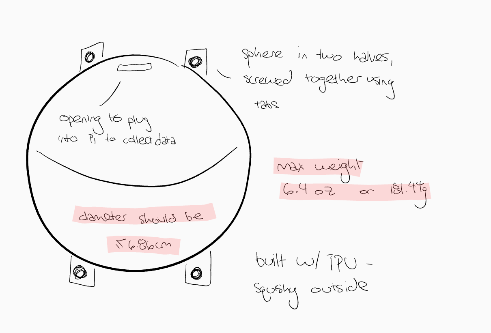

<b> Preliminary Interior Diagram </b>


I still have some different ideas about how different aspects of the project will work. The main concern is survivability, and hopefully, I will be able to use a squishy 3D-printed material to minimize damage to the shell on impact. However, having an exterior that squishes might create difficulties with the wiring and circuit boards as it could damage interior circuitry. Suspending the electrics with respect to each, for example by having springs between them, could potentially protect from this damage. Depending on the level of squish, padding between different elements might be sufficient. 

<b> Problems and Solutions Brainstorming </b>

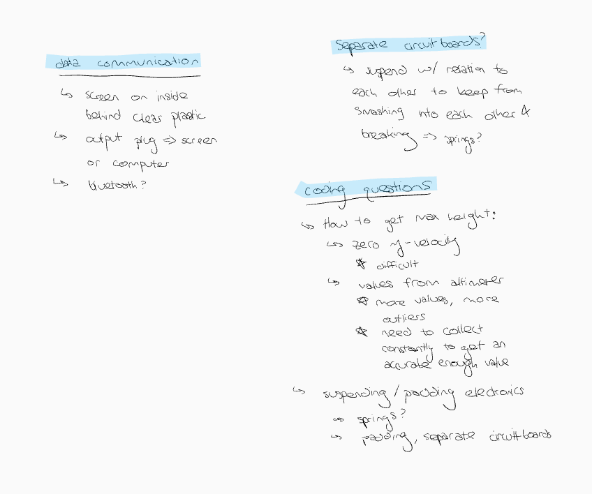


<b> Code Block Diagram </b>

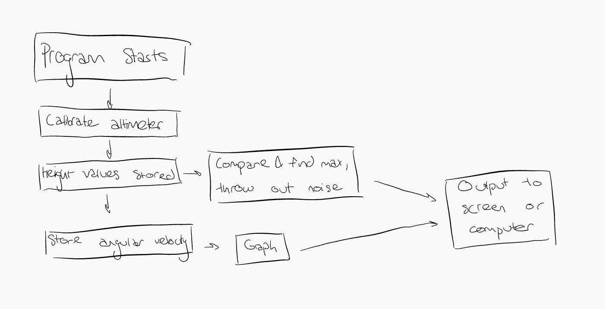

<b> Safety </b>

The projectile will experience high impact speeds, so it's important it doesn't smash into a million pieces on impact. In order to ensure this, controlled tests will be conducted by dropping/throwing it from heights and making sure the shell is thick enough not to break. The use of squishy material will also help this. The rest of the safety concerns are all trebuchet launch related - people will need to stand away from the swinging arm. 

<b> Materials </b>

I expect this project will require:

* Raspberry Pi Pico (1x)
* Altimeter (x1)
* Gyroscope (x1)
* 3D-printer material (enough for a 6.86cm diameter sphere of probably about 2.5mm thickness)
* Screws for putting the shell together
* Custom soldered circuit boards to mount electronics on

<b> Schedule </b>

* Deadline: April 1
  * CAD done by end of January
  * Code done by middle of February
  * All prints and circuit boards done by end of 1st week of March
  * Assembly and durability testing throughout March
  * Finished by April 1
* Iteration and fixes

[Back to top of section](https://github.com/lgray52/CapstoneProject/blob/main/README.md#projectile)

## CAD

I used OnShape to model all parts.

### Projectile
The primary challenge for the projectile is to fit all of the electrical components into a sphere the size of a tennis ball and keep everything under the 181g weight limit while designing it to be structurally sound enough to survive repeated impacts. In the design process, I decided to 3D print a sphere using a dual-layer design with squishy TPU on the outside and rigid PLA on the inside. This way, the impact stress will be absorbed by the outer layer while the electronic components on the inside will not be squished or smashed against one another. To fit the circuit boards in, I created flat faces perdendicular to the direction the Pico will be suspended to allow all the components to fit in properly. There will also be room for a powerboost and internal padding.

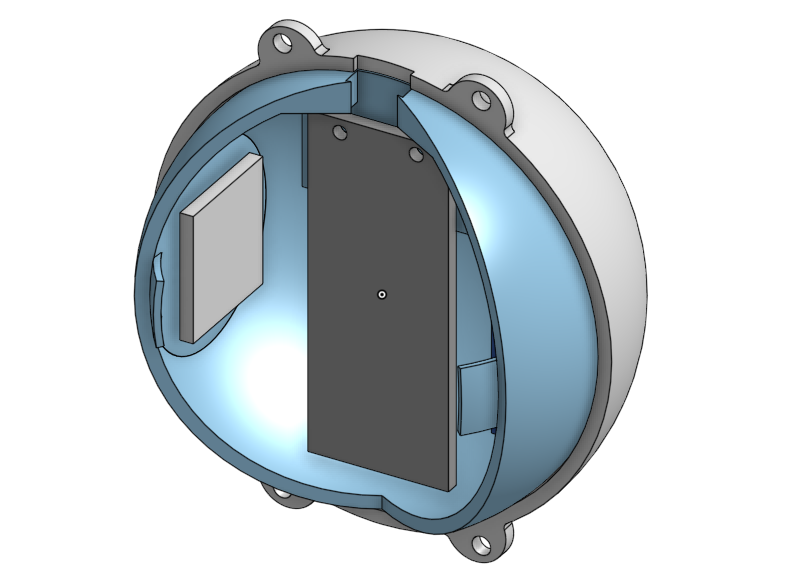 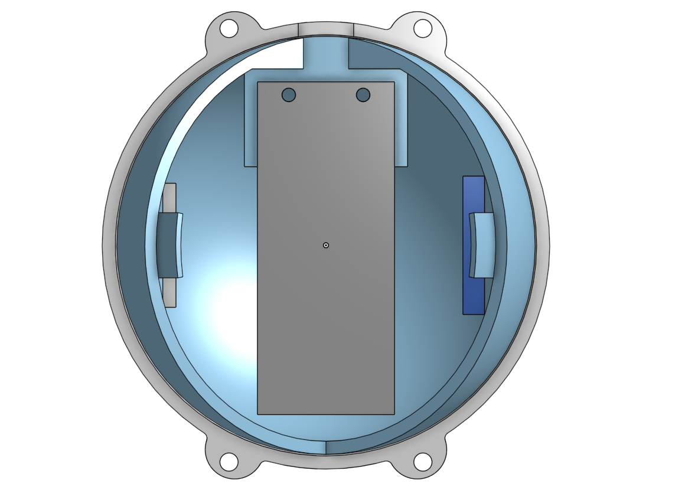 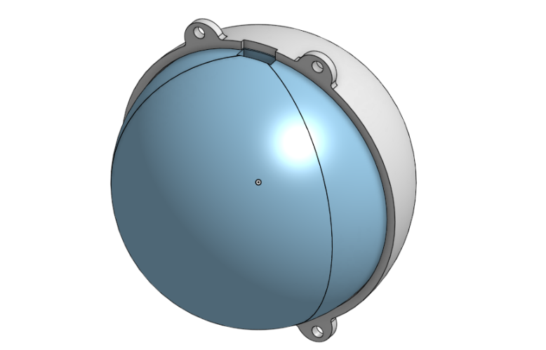 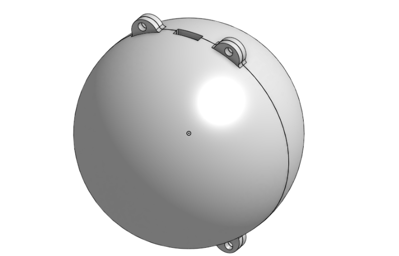

*[Projectile CAD](https://cvilleschools.onshape.com/documents/8d3a5e693f3cf33ca7e5bdc1/w/83808f7c6e04da8df33e76c7/e/95c830c3264aed7347df3daa?renderMode=0&uiState=645e76d238eafd55bede0946)*

### Control Box
I also designed a control box to store the electronics which will be able to arm the projectile and print the returned launch data to a screen. I added this aspect to my original design as a solution for the transmission of information from the projectile. The design of this box was simple, and my only real requirement was that it could be easily handheld and easy for Mr. Manning to use. For this reason, instructions will also be etched on the side of the box to make the usage of the control box crystal clear. I made the control box to be cut out of acrylic with the laser cutter.

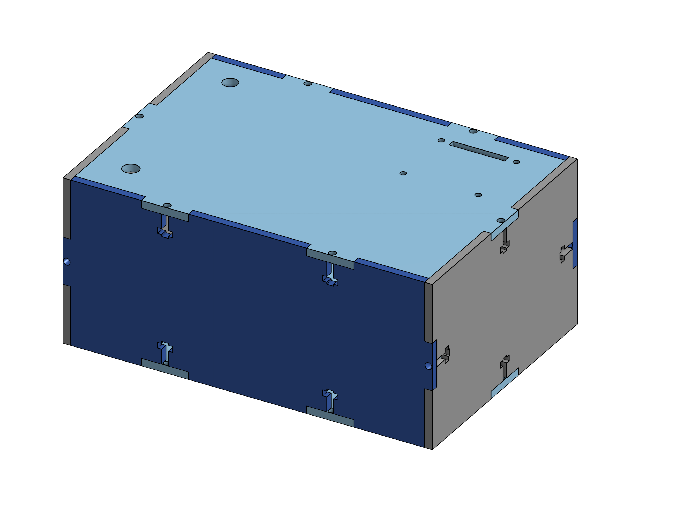   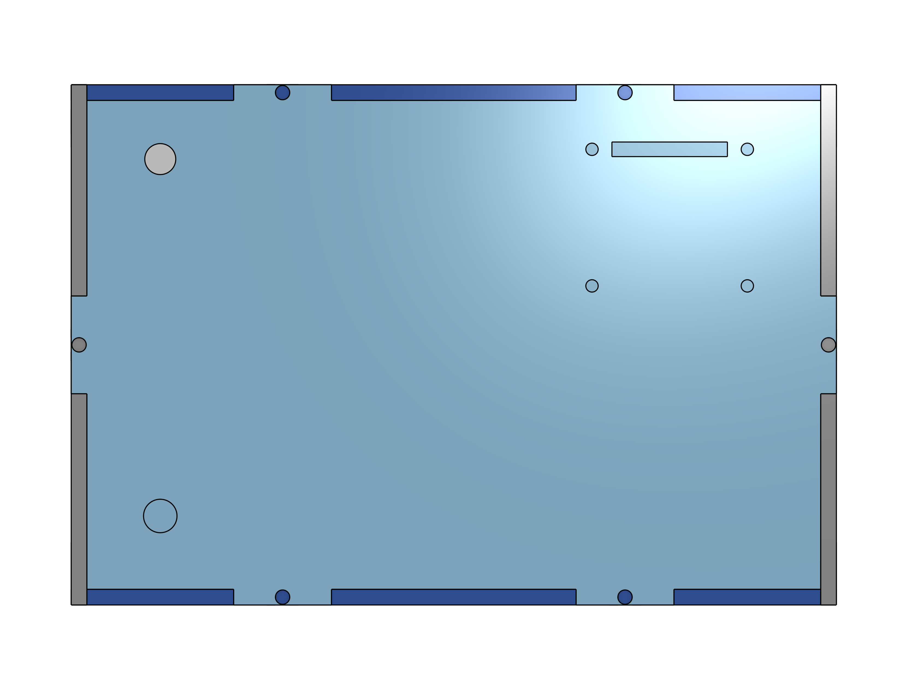   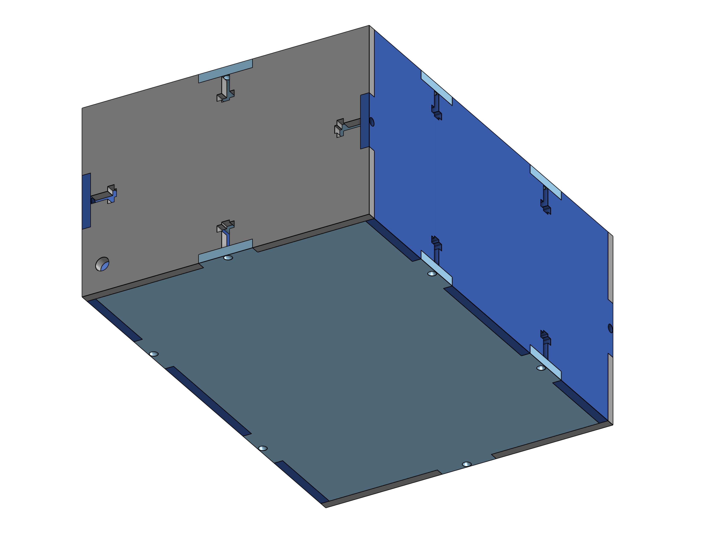

*[Control Box CAD](https://cvilleschools.onshape.com/documents/8d3a5e693f3cf33ca7e5bdc1/w/83808f7c6e04da8df33e76c7/e/e94914d4094986ac800e3476?configuration=List_tYLpmbiOPNIlMj%3DDefault&renderMode=0&uiState=645e76f938eafd55bede0a2a)*

[Back to top of section](https://github.com/lgray52/CapstoneProject/blob/main/README.md#projectile)

## Code
*All code written in CircuitPython for Raspberry Pi Pico boards*

[↓ Jump to final code and wiring ↓](https://github.com/lgray52/Pi-in-the-Sky_Projectile/blob/main/README.md#final-code)

### Starting the code

The first big issue I had to address was starting the data collection sequence of the projectile. I decided to try to communicate between two Pico boards to send a signal from one to the other to start and stop data collection using a button attached to the iniator board. I originally discovered [this library](https://github.com/kevinmcaleer/easy_comms), then realised it was written in MicroPython, making it incompatible with the CircuitPython I am using in the rest of the project. Since MicroPython and CircuitPython are quite similar in many regards, I tried to translate the library to CircuitPython, but it quickly became clear it would be easier to use code written in CircuitPython. Based on the Easy Comms library, I was able to narrow my search to a CircuitPython-based UART-reliant communication system, which I found [here](https://learn.adafruit.com/circuitpython-essentials/circuitpython-uart-serial). This example code was very useful to build a sending and receiving code operating over UART. [Here](https://github.com/lgray52/Pi-in-the-Sky_Projectile/blob/main/code/uartTest.py) is the test code I wrote and am using to structure future comms.


### Adapting reading message into function library

One issue I had with the code above is that, while functional, the section which is able to retrieve a message is long and a little bit clunky since it's reading the message one byte at a time and stringing it together letter by letter. The purpose of doing this in the original code is to designate responses by the message type based on a one-letter key at the beginning of a message, a functionality which is not needed in my code. I decided to put the message-reading section in a function so I could use it repeatedly, but unfortunately the stringing the message together relies on a loop. A loop inside a function is a slippery slope to figure out since its easy to accidentally get stuck inside a loop within a function, so I decided to try a different approach by reading more bytes over the line. I found the very handy decode() method which turns bytes into a string which is the ideal output, allowing me to simplify the message-getting approach significantly. Here is the finished function:

``` python
from time import sleep

def getMessage(uart):
    message = 0

    byte_read = uart.read(40)  # Read a bunch of bytes to make sure it gets the whole message
    sleep(.2)  # make sure it has enough tine to read the whole message while not causing awkward delay

    if not byte_read:  # Nothing read.
        pass

    if byte_read:
        message = byte_read.decode()  # decode bytes into a string
        print(f"Message received: {message}") 
    
    return message
```


### Finding the maximum height values and eliminating outliers in the data

Since I am going to need to be able to find a reliable measurement of maximum height, I decided I needed to write a short function to separate out outliers since the data from the altitude sensor is prone to random spikes. CircuitPython makes it very easy to find a maximum value with the max() method, so I just had to figure out how to reove outliers using statistics with the very handy ulab/"micro lab" (which allows many features of numpy, a very very useful library for anything beyond basic math, to work in CircuitPython). I tried this using mean first, but big outliers skewed the mean significantly and threw the maximum data point off, so I switched over to median. Below is the completed function. 

``` python
from ulab import numpy as np

def findMax(vals):
    real_vals = []
    medianVal = np.median(vals)
    devs = []

    for d in range(len(vals)):  # make a list of all the deviations from the median (mean ends up too skewed)
        devs.append(vals[d] - medianVal)
    
    deviation = np.sqrt((sum(devs))/len(vals))  # add them up and find the standard deviation

    for i in reversed(range(len(vals))):  # cycle backward through list so as not to mess up indices
        zScore = (vals[i]-medianVal)/deviation  # find the z-score (how far removed from the data it is) based on median

        if zScore <= 3:  # add all close enough vals to real vals list, excluding outliers > 3 stdevs from the median
            real_vals.append(vals[i])

    maxVal = max(real_vals)
    
    return maxVal
```

### Passing the maximum value back to the control box

This was unexpectedly very challenging since I didn't have a system in place for catching a message at a specific moment in the code when it was sent. All of the previous messages I needed to send contained specific text that I was using as an activation key, whereas the maximum value is a number that will vary from launch to launch. This meant that I couldn't employ the tactic of just running a "while True" loop and looking for the message to be a specific sentence. Instead, I had an activation key sent back and forth to ready both boards and then catch the message by reading bytes until the beginning of the message (a filler character) is detected, after which it catches the max height. This very nearly worked, but it seems that the UART spits over messages extremely quickly so almost 50% of the time the message it was catching was a zero. The solution I came up with is causing it to enter a while loop to keep looking for the real message if the message it gets is "0". I don't anticipate this will be a problem because if the measured max height is ever actually zero, I will have much bigger issues than transmitting the max height. This works quite well and prints nicely to the screen. 

<table>
<tr>
<th align="center">

<p> 
<small>
PROJECTILE CODE
</small>
</p>
</th>
<th align="center">

<p> 
<small>
CONTROL BOX CODE
</small>
</p>
</th>
</tr>
<tr>
<td>

```python
uart.write(bytes(f"Sending max height...", "ascii"))  
# send sender a message to prepare to receive max height
message = getMessage(uart)

while message == 0:  
# wait until message is sent back over that sender is ready to receive
    message = getMessage(uart)  # continue to check message

if message == "Ready for max height":  
# when confirmation is received, send max height
    uart.write(bytes(f" {str(max)}", "ascii"))  
    # need to add one space before message so that it can read 
    # that a byte is sent before getting the whole message
```
  
</td>
<td>
  
```python
if getMessage(uart) == "Sending max height...":  
# wait for message which tells sender to prepare to receieve max height
    waitForMax = True
else:
    waitForMax = False

if waitForMax:  # tell receiever the sender is ready
    uart.write(bytes(f"Ready for max height", "ascii"))
    waitForMax = False

    byte_read = uart.read(1)

    while byte_read == None:  
        # read one byte at a time until it 
        # gets a message which isn't None
        byte_read = uart.read(1)

    maxHeight = getMessage(uart)  
    # read the message after the first detected byte

    while maxHeight == 0:  
        # max height almost certainly should not be zero -
        # correct transmission skip
        maxHeight = getMessage(uart)

    maxStr = f"Max height: {maxHeight}m"  
    # set as var to pass to serial and the oled screen
```
</td>
</tr>
</table>


### Finding the time of flight

Upon talking with Mr. Manning, I decided to include a timing function. My initial idea is to use time.monotonic() to measure the amount of time in a state of freefall between major accelerations. I briefly considered including a timer on the control box when this code was not working, but on debugging my initial code I realized it would work as I thought. The MPU accelerometer I'm using is calibrated so that freefall constitutes an acceleration of zero, so if the projectile knows it has not been launched (has not experienced freefall) that it should be looking for when it enters freefall to tell when it is launched. Once it knows it has been launched, it should be looking for when it experiences an acceleration from hitting the ground, which will be larger than the acceleration due to gravity (about 9.8 $m/s^2$ but usually between 8 and 11 in the accelerometer's readings). This allows what seems to be a fairly accurate time of flight, but I will probably need to test this code headless since dropping my circuit board from the table to a chair is not far enough to see whether or not the time value is consistent. Proof of concept code [here](https://github.com/lgray52/Pi-in-the-Sky_Projectile/blob/main/code/accelTest.py).

### Sending the time of flight to the board
The last obstacle I had was combining the time of flight code with the main projectile code and sending it to the control box. When I combined the time of flight code with the code which collected altimeter values, I noticed that the acceleration values collected much slower than when the acceleration code is isolated. I realized that this is because the altimeter values collect quite slowly to get more accurate values. With Mr. Miller's help, I found [the GitHub for the MPL altimeter](https://github.com/adafruit/Adafruit_CircuitPython_MPL3115A2/blob/main/adafruit_mpl3115a2.py) and was able to adjust the speed with which the altimeter collects data by modifying the collection rate in the library at line 150 in the GitHub document. This done the acceleration collects a little faster, allowing me to test the combination of max height and time of flight transmission. Sending the data was fairly straight forward since I was able to modify the code I had already written to transmit the max height to include a section for the time of flight, as shown below.

<table>
<tr>
<th align="center">

<p> 
<small>
PROJECTILE CODE
</small>
</p>
</th>
<th align="center">

<p> 
<small>
CONTROL BOX CODE
</small>
</p>
</th>
</tr>
<tr>
<td>

```python
"""send data to control box"""
uart.write(bytes(f"Sending data...", "ascii"))
message = getMessage(uart)

while message == 0:  # keep checking for message
    message = getMessage(uart)
        
# will send max cue first and then time
if message == "Ready for max height": 
    uart.write(bytes(f" {str(max)}", "ascii")) 

message = getMessage(uart)

while message == 0:  # keep checking for message
    message = getMessage(uart)

# send the time cue
if message == "Ready for time":
    uart.write(bytes(f" {str(totalTime)}", "ascii"))
```
  
</td>
<td>
  
```python
if getMessage(uart) == "Sending data...":  
    # wait for message which prompts to prepare for max height
    waitForData = True
else:
    waitForData = False

if waitForData:  # tell receiever the sender is ready
    uart.write(bytes(f"Ready for max height", "ascii"))
    waitForData = False

    byte_read = uart.read(1)

    while byte_read == None:  
        # read one byte until it gets a message which isn't None
        byte_read = uart.read(1)

    maxHeight = getMessage(uart)  
    # read the message after the first detected byte

    while maxHeight == 0:  
        # this corrects a transmission skip problem
        maxHeight = getMessage(uart)
    # record max height
    maxStr = f"Max height: {maxHeight}m"

    # Time of flight
    uart.write(bytes(f"Ready for time", "ascii"))
        
    byte2_read = uart.read(1)

    while byte2_read == None:  # same strategy as above
        byte2_read = uart.read(1)
        
    tof = getMessage(uart)

    while tof == 0:
        tof = getMessage(uart)
    # record time of flight
    tofStr = f"Time: {tof}s"
```
</td>
</tr>
</table>

### Final Code

* [Function library](https://github.com/lgray52/Pi-in-the-Sky_Projectile/blob/main/code/projectileLib.py)
* [Code for control box](https://github.com/lgray52/Pi-in-the-Sky_Projectile/blob/main/code/commsControl.py)
* [Code for projectile](https://github.com/lgray52/Pi-in-the-Sky_Projectile/blob/main/code/commsProjectile.py)

### Wiring Diagram

Note: both will also have wires from the RX and TX pins from one to the other as well as a common ground.

<table>
<tr>
<th align="center">

<p> 
CONTROL BOX
</p>
</th>
<th align="center">

<p>
PROJECTILE
</p>
</th>
</tr>
<tr>
<td>
 
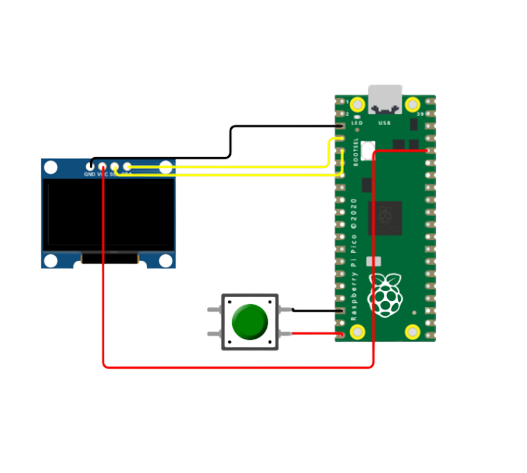

<sup><sub> Reset pin will be connected to GP5. </sub></sup>
</td>
<td>

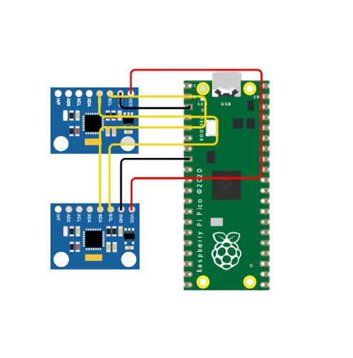

<sup><sub> The MPL altimeter is here represented by an MPU accelerometer - their wiring is the same. </sub></sup>
</td>
</tr>
</table>

[Back to top of section](https://github.com/lgray52/CapstoneProject/blob/main/README.md#projectile)

## Physical

<b> Box </b>

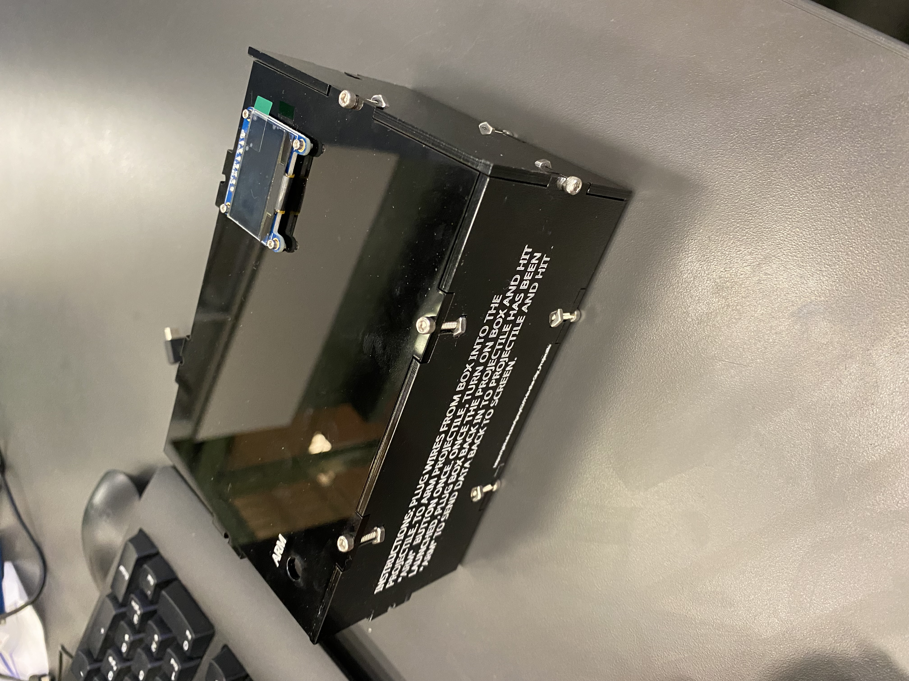 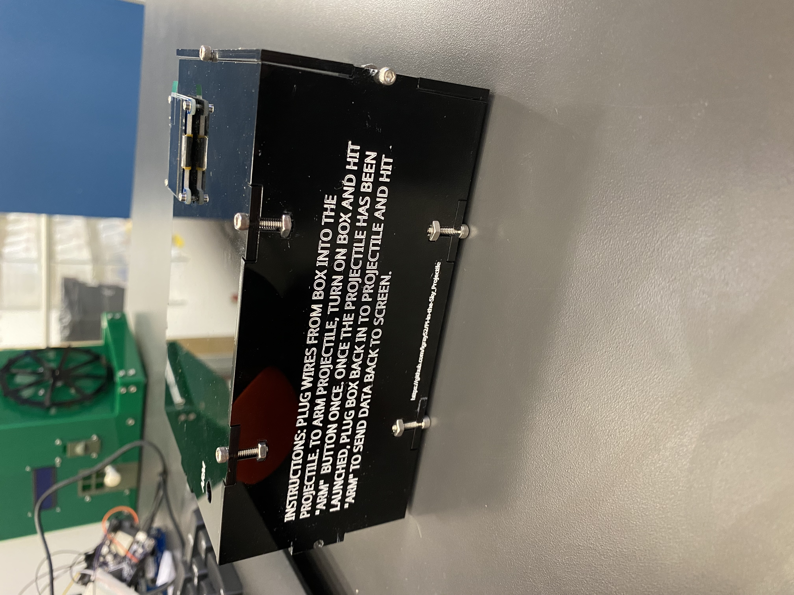

<b> Projectile </b>

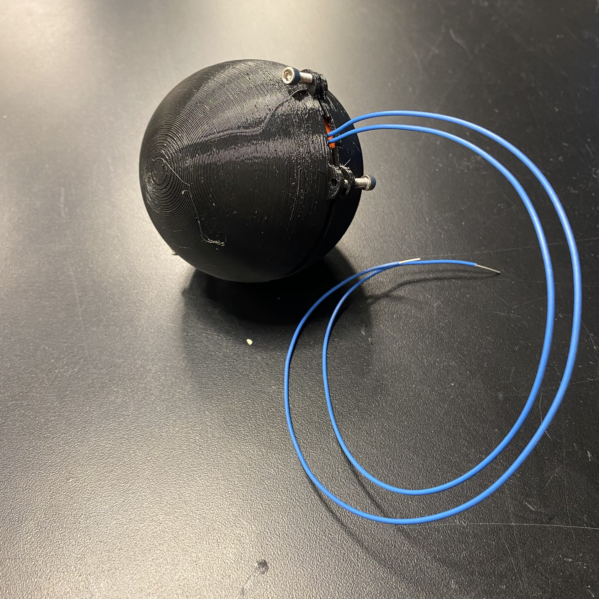 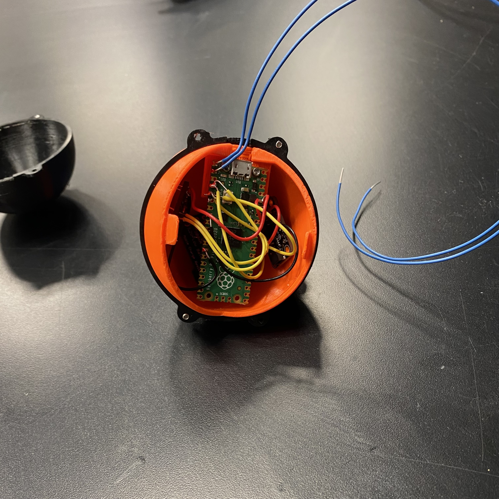 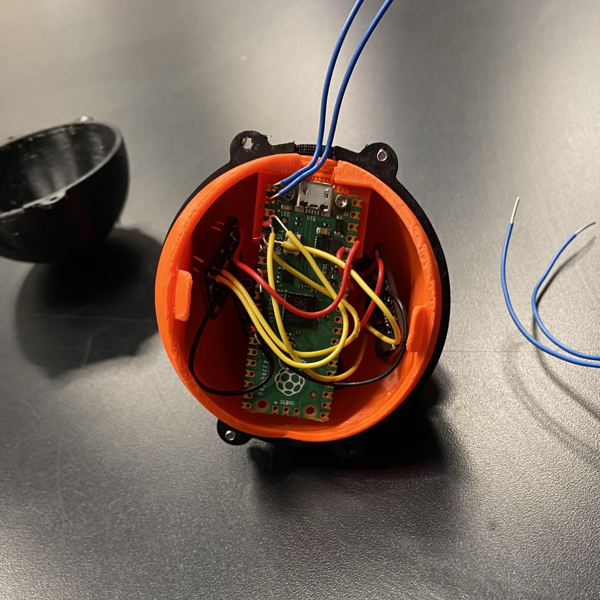

The physical assembly of the projectile and control box have gone very smoothly. The only major assembly points were soldering the Pico for the control box onto my circuit board and soldering the components for the projectile to the projectile Pico. There is exactly enough space for the powerboost and a small lipo battery inside the projectile, and the shell held up very well with tabletop height drops. The thickness of the shell and the use of TPU for the outer shell lends it what I believe will be excellent survivability. The control box also came together well, although I did modify the design slightly from the original to remove the on/off switch as the battery holder I found has its own. 

<b> Materials</b>

I ended up using...

* Raspberry Pi Pico (2x)
* Altimeter (x1)
* Gyroscope (x1)
* OLED screen (x1)
* Button (x1)
* Battery pack (x1 for projectile and x1 for control box with built in on/off switch)
* 3D-printer material (enough for a 6.86cm diameter sphere of probably about 2.5mm thickness - both squishy and solid material)
* Acrylic for control box
* Screws
* Wires
* Custom soldered circuit boards to mount electronics on

### Issues
<b> Message error</b>

The main issue I ended up running into was a strange error in the transmission. When I unplugged the projectile from the box, it turned out that the projectile was receiving a completely blank message. It took me a while to figure out what was going wrong - my first thought was that touching the wires was throwing the transmission off. However, the problem persisted even when I got a system working to plug the projectile to the box with headers, so the problem was not actually touching the wires. As it turned out, unplugging the two Picos was throwing the projectile's board an unreadable byte sequence. Because it couldn't translate it, the message it was throwing the board was neither nothing nor zero, the two things that the code was looking for to keep collecting data. I was able to filter out these unredable bytes in the message receiving function, and so far that has worked quite well.

<b> Altimeter Drift</b>

I also ended up encountering a very strange error where even if the projectile was left in the same spot, the reading from the altimeter was dropping by about a meter a minute. This was also experienced by a couple other groups - because my code has remained the same and it was not an issue before, it seems like I would need to find a new altimeter to fix the problem, and I'm not willing to solder a new one on at this point. However pretty much everything else is working since I switched out the battery that caused the board do wipe its own processing system whenever the battery was unplugged. 

<b> First Test "Launches" </b>

Once I was able to get the minor issues out of the way, I was able to do a couple test "launches" in the lab. By throwing the projectile up, I was able to get data and send it to the control box. It printed properly, so I hope I will be able to launch from the trebuchet very soon!

<b> Working projectile and data reading</b>


Unfortunately this video was taken after the altimeter drift started affecting my max height values but the whole system is working except for the erroneous maximum height reading. Overall, I'm pleased with the final product and proud that I was able to accomplish quite a complicated system in just a little over a semester (despite intense senioritis). 

[Back to top of section](https://github.com/lgray52/CapstoneProject/blob/main/README.md#projectile)

[Back to Table of Contents](https://github.com/lgray52/CapstoneProject/blob/main/README.md#table-of-contents)

# Launch

<b>1.26.23.</b> Today was our first launch. It went pretty smoothly compared to expectations. The ball stayed in the pouch until release, and we had minimal issues with the weights sliding off. We don't have our hose clamps yet so there is nothing keeping the weights on the arm. All of our releases were a bit late, as you can see in the drawing below. The variables we are experimenting with for launch are projectile mass, sling length, sliphook angle, and the pouch. Today we just wanted to see if it would work, but going forward we will be more exact and measure the angle of the sliphook with a protractor. 

 

<b>1.27.23.</b> Today we started using a compass to measure the angle of the sliphook. Below is how we quantified negative vs positive positions. 


The pink dots show where the ball was when it was released, and the pink line shows the position of the arm at the time of release in relation to the vertical. 

<b>-10°</b>


At ten degrees, the ball was released much earlier than we wanted and went almost straight up. 

<b>-20°</b>


To further decide if we wanted to use a positive angle, we made the angle more steeply negative. The ball went straight up again. 

<b>13°</b>


This was the test that was the most successful. We think it went approximately 50 yards. 

<b>20°</b>


This one went a slightly shorter distance, so we definitely don't want a higher angle than 20 degrees. 


<b>02.07.23.</b> We took the trebuchet to the track field today to see how far it launches in terms of yards.


It ended up launching about 50-55 yards, or half the length of the field. We used a lacrosse ball, which did bounce and roll a little bit further, so the final position we found the ball from launch point was probably about 60 yards away. 


<b>04.18.23.</b> We decided to have some fun with the trebuchet and launch apples. They launched very well and splattered very nicely. With some more weight on the trebuchet, it could probably be used to launch slightly larger fruits/vegetables/squashes, a usage which some teachers have taken interest in - like Mr. Davis' suggestion of using it for a pumpkin chuckin. Additionally, the apples launched quite far, maybe 50 yards.


<b>Apple remains:</b> 
The apples we launched were thoroughly exploded on impact. Here are some pictures of the larger suriving pieces of the first apple we launched, whose pieces ended up as much as 10 feet apart. This impact force is important to consider for the projectile. 

 

[Back to Table of Contents](https://github.com/lgray52/CapstoneProject/blob/main/README.md#table-of-contents)

# Desk Trebuchet

### Overview

We decided after a lull in productivity that we would test out another possible design on a smaller scale. We initially wanted to try a whip trebuchet design that we saw on youtube, but we realized it would be extremely difficult to do. Our goal is for the desk trebuchet to launch a marble which is about 5g. In order to optimize launch the counterweight needs to be around 100x the mass of the projectile. On the scale we were dealing with, it was impossible to get 500g in a small enough size to fit on the arm. The 500g weights in the physics room were huge and would have made it impossible to launch. Instead we decided to go with a flywheel design. From an educational standpoint, it offers a great example of both rotational motion and energy storage. We also thought it would be easier to do because it removes the need for such a large counterweight. 

### Onshape Design 

The design we landed on was based on a [video](https://www.youtube.com/watch?v=RVT5i4nhIGs&scrlybrkr=31fda7cd) we found on youtube. The man who built the flywheel trebuchet was the same person who made the whip trebuchet that we initially wanted to try. The idea behind the flywheel trebuchet is storing rotational kinetic energy in the wheel by spinning it. The energy for launch comes not from gravitational potential energy, but from rotational kinetic.

Below is our initial design in Onshape. 

 

We decided that it was a good opportunity to have some more fun with the design, as we had initially hoped for the bigger trebuchet. We opted for clear, 6mm acryllic for the frame. Below is a picture of flames we designed to put on the sides, which we cut from transparent red, orange, and yellow acryllic. 

 

### Physical design

We cut the trebuchet out of 6mm clear acrylic. The arm is screwed onto the fly wheel, and a small amount of mass is fixed to the wheel end of the arm across from the long throwing arm. This moves the center of mass to the rotation point, meaning that gravity provides little to no torque on the arm as it is spinning - this is the primary priinciple of the flywheel trebuchet as it does not rely on transfer of gravitational energy to kinetic energy, instead using on the rotational kinetic energy of the spinning arm. The pictures below show the trebuchet with only one set flames. 

 

### Pulley system

The rotation relies on a pulley system with a hand crank. We 3D printed the pulley parts and fixed them to an additional axle with a rubber band connector. We had to reprint both since it turned out we needed deeper grooves compared to our original design to keep the pulley belt in place and we needed a little bit more space between the top piece of the pulley and the arm since the belt kept hitting the screws keeping the arm and the wheel together. 

<b> Pulley system: </b>

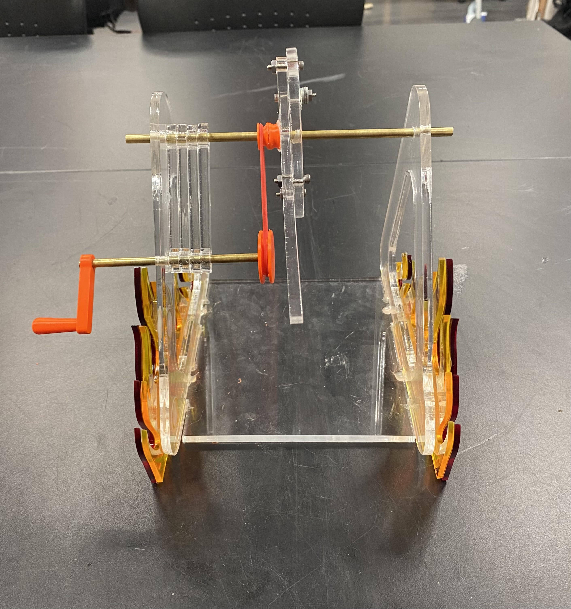 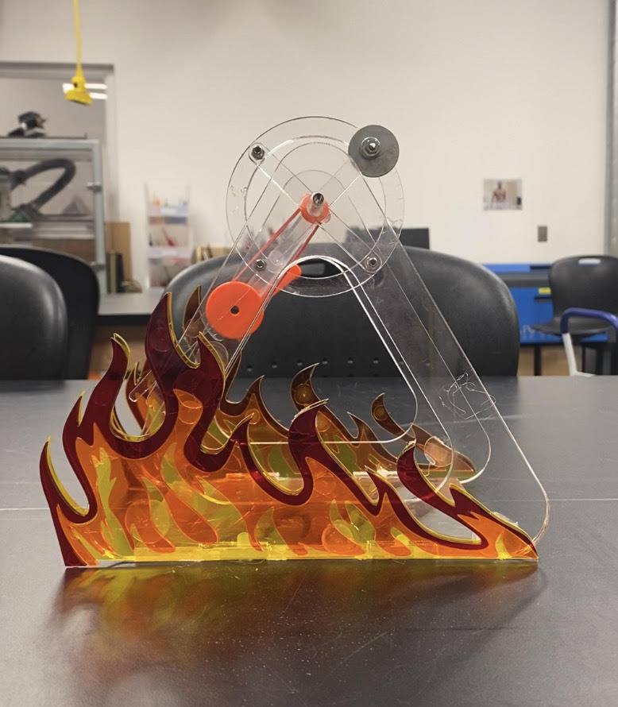

<b> In action: </b>


[Back to Table of Contents](https://github.com/lgray52/CapstoneProject/blob/main/README.md#table-of-contents)

### Release system

<b> Sling </b>

For the sling we used the same design as for the larger trebuchet. 

 

The [design](https://www.youtube.com/watch?v=RVT5i4nhIGs&scrlybrkr=31fda7cd) we based the mini trebuchet off of was very complicated, particularly in the release system. An arm comes out when a switch is pressed which knocks the the sliphook to release the sling. We could not replicate this on a much smaller scale. 

  

We decided we would have to design a different method of release. We knew that the release couldn't be manual, because the launch would be inconsistent and hard to time correctly. Our plan is to use a pin that releases the projectile when the string becomes taut. We can measure the length of the string so that, given it starts in the same position every time, the pin will be pulled at the same time each launch. The pictures below show the saddle that keeps the sling from releasing. We used a nail we found in the lab as a release pin. 

   

 

Our first design (1.0 in the diagram) was to wrap the string around a bobbin as the flywheel rotated. This did not work, because the string continually wrapped around the axis instead of the bobbin. Another critical aspect of the design is that the string needs to become taut at an angle that pulls the pin straight out (or as straight as we can get it). The string wound better when we moved the bobbin closer to the flywheel, but it wouldn't work from a release standpoint. We also tried putting a hole in the side of the bobbin so the string had less room to move. This also did not work. 

  

The idea for our second design (2.0)came from watching [a video](https://www.youtube.com/watch?v=XMPx9aF5eg4) of a sewing machine winding a bobbin. We decided to try putting one of the bobbins straight up instead of on its side. The two bobbins together keep the string from coiling around the axis as the flywheel turns. 

[Back to Table of Contents](https://github.com/lgray52/CapstoneProject/blob/main/README.md#table-of-contents)

### Whipper model

At this point, the flywheel trebuchet had gotten really complicated, and though it was working more consistently there was a lot left to iron out. Since Mr. Manning is leaving earlier than expected because of the baby, we decided to redirect ourselves slightly and try a new type of trebuchet arm, a whipper trebuchet. Whipper trebuchets are unique because they do almost a full rotation before they release, and they store a lot more energy by having the swinging counterweight start above the arm. They also need a much lower ratio of mass between the counterweight and the projectile to launch further than a traditional hanging counterweight trebuchet. The whipper trebuchet gets its name from the way it whips around the axle and launches at extremely high speeds.

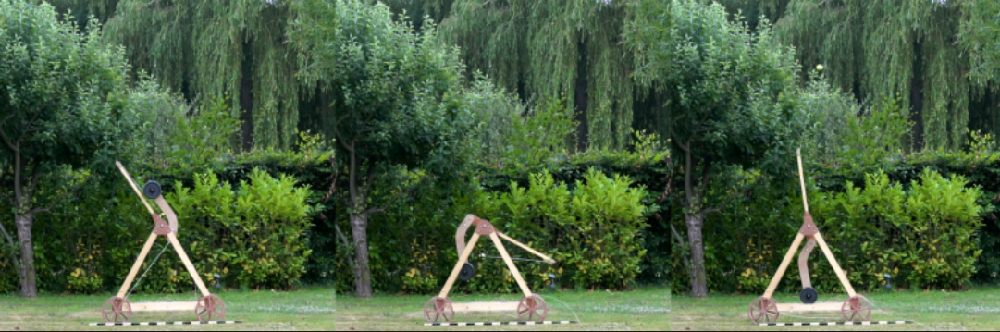

<b> Construction </b>

We built the new arm out of the same clear thick acrylic. It is sized to fit on the same axle that the flywheel arm was built for. For the hanging counterweight, we used 187g of washers. We found this enormous mega washer which the hanging arm length ended up having to be based on since it is so large, but it did add over 80g of mass to the hanging arms. The release system is the same as a traditional trebuchet, with a slip hook and standard sling. This made it a lot easier than the highly complex flywheel release system. 

<b> Launching </b>

With the building done, we got straight to launching. To launch the trebuchet, the sling needs to be loaded and the counterweight needs to be lifted over the marble in the sling. The whole arm needs to be placed in the direction you want it to launch. 

Our first launches were hard to measure since we were in the back. However, once we moved to the front and were able to launch in a straight line down the hallway, we were able to see that the marble was already launching 10-15 ft without any fine tuning. We did have to change and adjust the angle of slip hook, but once we were able to get the ratio of the length and angle right, the mini trebuchet consistently launches 15-20 ft on flat ground. 


[Back to Table of Contents](https://github.com/lgray52/CapstoneProject/blob/main/README.md#table-of-contents)
